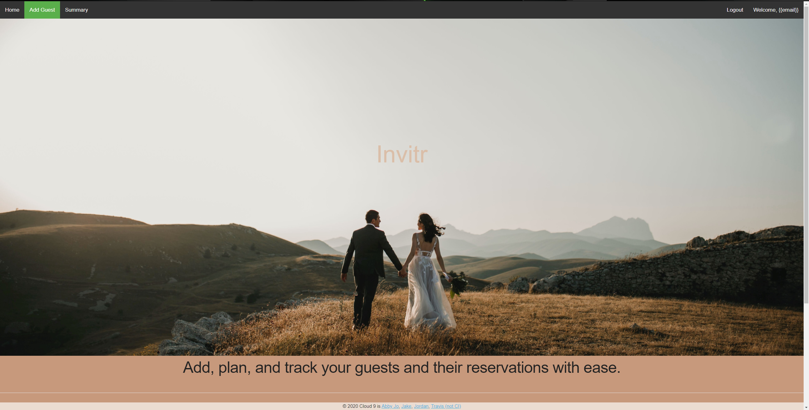
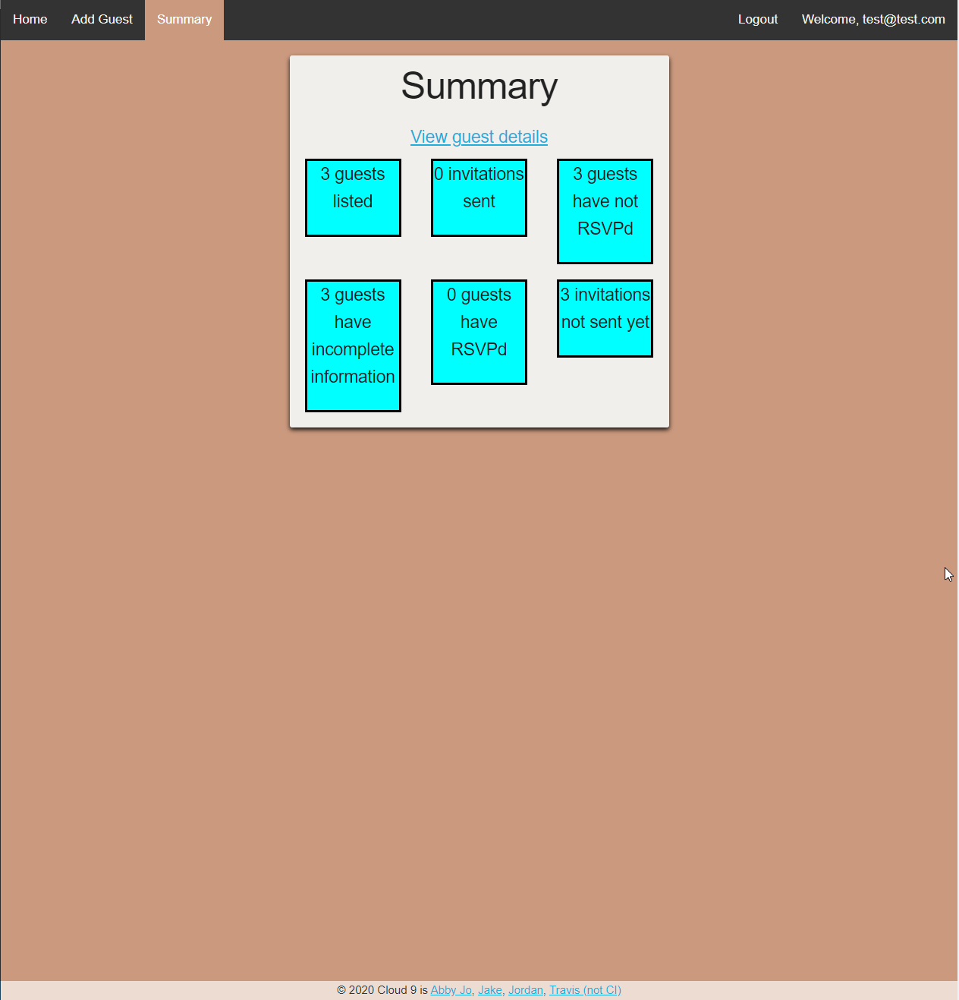
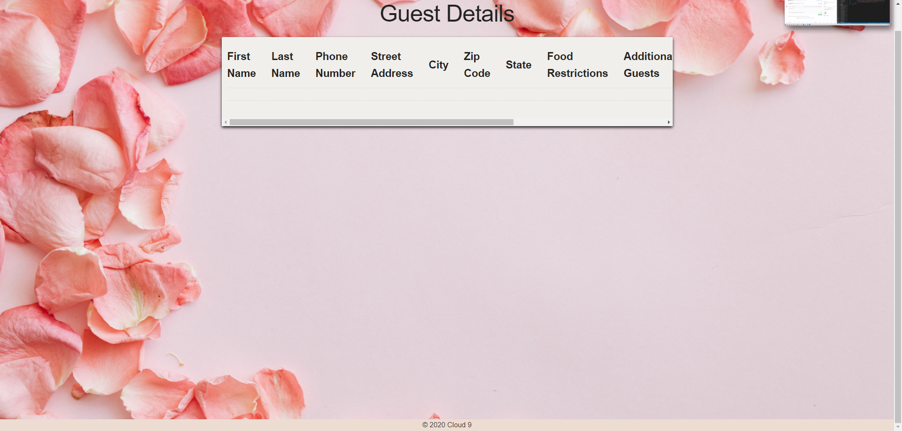
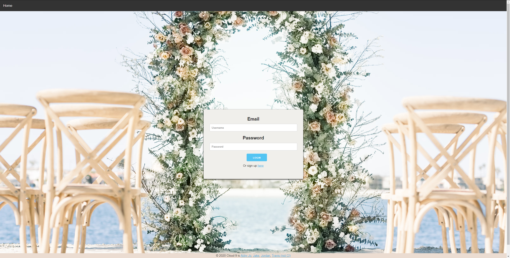
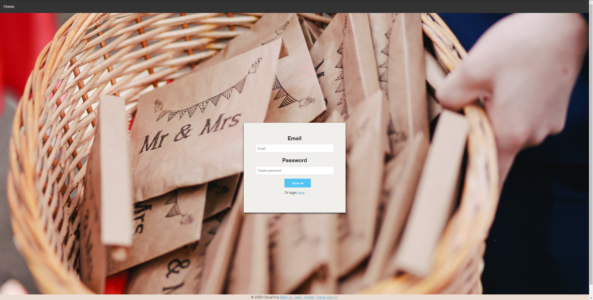

# Invitr

## Table of contents
- [Description](#Description)
- [Instructions](#Instructions)
- [Installation](#Installation)
- [Technologies Used](#Technologies-Used)
- [Future Development](#Future-Development)
- [Contributors](#Contributors)
- [Credits](#Credits)

## Description 
Users can keep add guests to their wedding in this application so they can easily keep track of invites, addresses, and guest food restrictions. Users can also keep track of which guests have yet to RSVP. To use this application, the user must create an account and sign in.

The application can be accessed [here](https://scary-cat-18885.herokuapp.com/)

### Instructions
1. If you do not have an account with this application, click "Create new user". If you do have an account, please click "Sign in". 
2. Successful sign-in will lead to the summary page. This page displays the stats of your guests, like how many guests have RSVPd and how many have yet to receive an invitation. 
3. To view the guest details, click "View guest details" on the summary page. 
4. To add a new guest, click "Add guest" in the navigation menu at the top of the screen. 
5. Clicking "add guest" will open a page with a form in it. The form accepts any details that you chose to fill out, and no fields are required. 
6. Click "Submit" to save the guest and click "Cancel" to return to the dashboard without adding any details.

## Installation
  Run:

        npm i
        
  Start the server with:

        node server.js

## Technologies Used
- HTML
- CSS
- JavaScript
- Skeleton.css
- Font Awesome
- jQuery
- Express.js
- Handlebars
- Passport.js
- bcrypt.js
- Nodemailer
- mySQL
- Sequelize
- Github
- Heroku
- JawsDB
- Travis CI
- ESLint

## Future Development
Our team looks forward to the adding the following features:
- Connecting the numbers on the summary page to links so all of the guests in a category can be edited at the same time. 
- Adding filter and search options to the Guest Details page
- Adding a password change system so passwords can be reset

## Contributors
- Jordan Kirby, [Feizhi255](https://github.com/Feizhi255)
- Jake, [jburz](https://github.com/jburz)
- Abby, [abbynf](https://github.com/abbynf)
- Travis, [Teknix420](https://github.com/Teknix420)

## Credits
- Photo Credit to Unsplash and Moments By Taya Photography