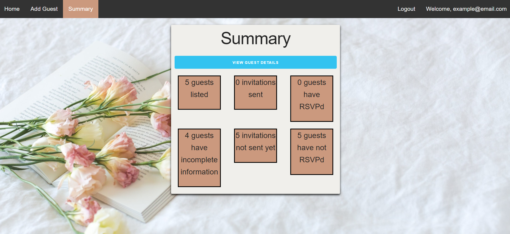

# Invitr

## Description 
Need to keep track of all your invites to your wedding? Or find what they their food restrictions are? Then this application is for you. Do all of this in one easy place **Invitr**

### Example image of landing page and everything else

////////

## Table of contents
- [Description](#Description)
- [Installation](#Installation)
- [Usage](#Usage)
- [Licence](#Licence)
- [Contributors](#Contributors)
- [Test](#Test)
- [Repository Link](#Repository)
- [GitHub Info](#GitHub) 
## Installation
  Run:

        npm i
        
## Usage
  Start the server with:

        node server.js

  Then open up your live server and behold the wonder of **Invitr**!!
## Licence

## Contributors
Jake, Abby, Travis, Jordan Kirby
## Test
eslint, Travis CL
## Repository
- [Invitr](https://github.com/jburz/Invitr)
## GitHub

- Jordan Kirby
- [Feizhi255](https://github.com/Feizhi255)

- Jake
- [jburz](https://github.com/jburz)

- Abby
- [abbynf](https://github.com/abbynf)

- Travis
- [Teknix420](https://github.com/Teknix420)